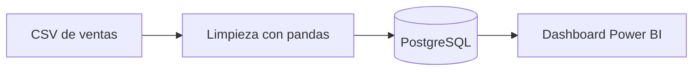

# Markdown: documentar con texto plano

**Bloque 0 -- Preparación | Sesión 4 de 5**

[← Volver al índice del curso](../README.md#bloque-0--preparación)

---

## 1. Introducción

El archivo que estamos leyendo está escrito en Markdown. También lo están los READMEs de GitHub, las celdas de texto de los notebooks de Jupyter, las descripciones de los pull requests y buena parte de la documentación técnica del mundo. Markdown es el formato en el que **un analista documenta su trabajo**, y hoy lo aprendemos entero: su sintaxis cabe en una hoja.

Lo pondremos en práctica con el archivo más importante de nuestro portfolio: el `README.md`, que sigue vacío y es lo primero que ve cualquiera que visite nuestro repositorio.

### Objetivos de la sesión
- Entender qué es Markdown, por qué se usa y dónde lo encontraremos en el curso.
- Escribir con la sintaxis esencial: encabezados, énfasis, listas, enlaces, imágenes, código, tablas y citas.
- Conocer las extensiones de GitHub: listas de tareas, alertas y bloques desplegables.
- Usar la vista previa de VS Code y la extensión markdownlint.
- Escribir el README de nuestro portfolio y una plantilla de documentación para las prácticas.

### Prerequisitos
- Sesiones 0.1.1 a 0.1.3 completadas: el portfolio está en GitHub y lo abrimos con VS Code.
- La extensión **markdownlint** instalada (sesión 3).

---

## 2. ¿Qué es Markdown y qué no es?

**Markdown es una forma de dar formato a texto plano usando símbolos sencillos.** Un `#` al principio de una línea la convierte en título; dos asteriscos alrededor de una palabra la ponen en **negrita**; un guion al principio de una línea crea un elemento de lista. El archivo sigue siendo texto plano (`.md`), legible tal cual en cualquier editor, y un programa lo convierte en una página con formato cuando hace falta.

Lo creó John Gruber en 2004 con una idea: que el texto con formato **se pudiera leer cómodamente incluso sin convertir**. Compara:

```markdown
## Resultados

Las ventas crecieron un **12 %** respecto a 2024, sobre todo en:

- Madrid
- Barcelona
```

Aunque no se convirtiera nunca, se entiende perfectamente. Esa es la clave de su éxito.

### Markdown vs Word

| | Word (`.docx`) | Markdown (`.md`) |
|---|---|---|
| Cómo se escribe | Lo que ves es lo que obtienes (WYSIWYG) | Texto con símbolos que luego se convierte |
| Formato del archivo | Binario (un `.zip` de XML por dentro) | Texto plano |
| Con Git | Git solo sabe que "el archivo cambió" | Git muestra qué líneas cambiaron |
| Dónde se abre | Word u otro procesador de textos | Cualquier editor; GitHub y VS Code lo muestran con formato |
| Diseño | Control total de maquetación | Estructura sí, diseño no |

Markdown no sustituye a Word para un informe maquetado con logotipos. Sirve para **documentación que vive junto al código y los datos**: versionada con Git, revisable en un pull request, legible en cualquier sitio.

### Dónde lo encontraremos en el curso

- **READMEs** de cada repositorio, incluido este manual.
- **Celdas Markdown de los notebooks de Jupyter** (bloque 3): el texto que explica el análisis entre celda y celda de código.
- **Pull requests e issues** de GitHub: las descripciones y comentarios admiten Markdown.
- **Respuestas de los asistentes de IA** (bloque 4): casi todos responden en Markdown.

### Sabores de Markdown

El Markdown original era ambiguo en algunos casos, y cada herramienta lo interpretó a su manera. Hoy hay dos referencias:

- **CommonMark:** la especificación estándar del núcleo del lenguaje.
- **GitHub Flavored Markdown (GFM):** CommonMark más extensiones de GitHub (tablas, listas de tareas, tachado). Es el que usaremos, y el que entienden VS Code y Jupyter.

### La frase clave

> Un análisis que nadie entiende no sirve de nada. Markdown es la forma más barata de que nuestro trabajo se entienda: texto plano, versionado con Git y legible en cualquier sitio.

---

## 3. Cómo trabajar con Markdown en VS Code

### Vista previa

Abrimos cualquier `.md` en VS Code y:

- **`Ctrl + Shift + V`** (`Cmd + Shift + V` en macOS): abre la vista previa en una pestaña nueva.
- **`Ctrl + K` y después `V`**: abre la vista previa **al lado**, que se actualiza mientras escribimos. Es la forma más cómoda de trabajar.

### markdownlint

La extensión que instalamos en la sesión 3 revisa el estilo mientras escribimos y **subraya en verde** lo que no sigue las buenas prácticas: un título sin línea en blanco alrededor, dos títulos principales en el mismo archivo, un salto de nivel de título... Pasando el ratón sobre el subrayado vemos la regla (por ejemplo `MD022`) y su explicación. No son errores: el archivo se ve igual. Son convenciones que hacen que el Markdown se interprete igual en todas las herramientas.

---

## 4. Sintaxis esencial

Para cada elemento mostramos lo que se escribe. Lo ideal es seguir esta sección con un archivo de pruebas abierto en VS Code y la vista previa al lado: `notas/pruebas-markdown.md`.

### Encabezados

```markdown
# Título del documento (nivel 1)
## Sección (nivel 2)
### Subsección (nivel 3)
#### Nivel 4
```

- Hay seis niveles, del `#` al `######`. En la práctica usamos hasta el cuarto.
- **Siempre un espacio** después de las almohadillas: `#Título` no es un título en GFM.
- Un solo `#` por documento (el título) y sin saltar niveles (de `##` no pasamos a `####`). Es lo que da una estructura clara y lo que usan los índices automáticos.

### Párrafos y saltos de línea

```markdown
Esto es un párrafo. Aunque lo escribamos
en dos líneas, se verá como una sola.

Una línea en blanco separa párrafos.
```

Es la regla que más sorprende: **un salto de línea simple no se respeta**; hace falta una línea en blanco para empezar un párrafo nuevo. Si necesitamos un salto de línea dentro de un párrafo, terminamos la línea con una barra invertida `\` (o con dos espacios, que funcionan pero son invisibles; por eso en la sesión 3 configuramos VS Code para no borrarlos en Markdown).

### Énfasis

```markdown
*cursiva* o _cursiva_
**negrita** o __negrita__
***negrita y cursiva***
~~tachado~~
```

Convención recomendada: asteriscos para todo. Y con moderación: si todo está en negrita, nada destaca.

### Listas

```markdown
- Elemento
- Otro elemento
  - Elemento anidado (dos espacios de sangría)
  - Otro anidado

1. Primer paso
2. Segundo paso
3. Tercer paso
```

- Las listas sin orden empiezan con `-` (también valen `*` o `+`; usamos siempre `-`).
- En las numeradas, Markdown renumera solo: podríamos escribir `1.` en todas y se mostrarían 1, 2, 3.
- **Deja una línea en blanco antes de la lista.** Sin ella, algunas herramientas la pegan al párrafo anterior.

### Listas de tareas (GFM)

```markdown
- [x] Instalar Git
- [x] Publicar el portfolio
- [ ] Escribir el README
```

En GitHub se muestran como casillas. Las usaremos en el README para marcar el progreso del curso.

### Enlaces

```markdown
[Documentación de pandas](https://pandas.pydata.org/docs/)

[Mi chuleta de terminal](notas/terminal.md)

[Ir a la sección de resultados](#resultados)

<https://github.com>
```

- **Enlace externo:** texto entre corchetes y URL entre paréntesis.
- **Enlace relativo:** a otro archivo del repositorio, con una ruta relativa como las de la sesión 1. Funciona en GitHub y en VS Code, y sigue funcionando aunque se mueva o se renombre el repositorio. **Es la forma correcta de enlazar archivos del propio proyecto.**
- **Enlace a una sección:** `#` y el título en minúsculas, con guiones en lugar de espacios y sin signos de puntuación (las tildes se mantienen: `## Instalación` → `#instalación`). GitHub genera estos anclajes automáticamente para cada encabezado.
- **URL entre `< >`:** se muestra tal cual y es clicable.

Si una ruta tiene espacios, los sustituimos por `%20`: `[Sesión](Bloque%200/sesion.md)`. Otra razón más para no usar espacios en nombres de archivo.

### Imágenes

```markdown

```

Igual que un enlace, con `!` delante. El texto entre corchetes es el **texto alternativo**: lo lee un lector de pantalla a una persona ciega y aparece si la imagen no carga. Escribimos qué muestra la imagen, no "imagen" ni "captura".

### Código

Para código dentro de una frase, **comillas invertidas** (*backticks*):

```markdown
Usamos la función `groupby()` sobre la columna `region`.
```

Para bloques de código, tres comillas invertidas antes y después, indicando el lenguaje para que se coloree:

````markdown
```sql
SELECT region, SUM(importe) AS ventas
FROM pedidos
GROUP BY region;
```
````

Los lenguajes que usaremos: `sql`, `python`, `bash`, `powershell`, `json`, `markdown`. Nombres de columnas, tablas, archivos, funciones y comandos siempre en formato código: así se distinguen del texto y no se confunden con palabras normales.

### Tablas (GFM)

```markdown
| Región    | Ventas (€) | Variación |
|:----------|-----------:|:---------:|
| Madrid    |    125.300 |    +12 %  |
| Barcelona |     98.450 |     +8 %  |
| Valencia  |     54.120 |     -3 %  |
```

- La primera fila son los encabezados; la segunda, obligatoria, separa encabezados y datos.
- Los dos puntos de la fila separadora controlan la alineación: `:---` izquierda, `---:` derecha (la adecuada para números), `:---:` centro.
- No hace falta alinear las barras verticales: es solo para que se lea mejor en texto plano. Esta tabla funcionaría igual:

```markdown
| Región | Ventas (€) | Variación |
|:--|--:|:-:|
| Madrid | 125.300 | +12 % |
```

### Citas

```markdown
> Sin datos, solo eres otra persona con una opinión.
> — W. Edwards Deming
```

Además de citas literales, en documentación se usan para **destacar avisos**, como hacemos en este manual.

### Separadores

```markdown
---
```

Tres guiones en una línea (con una línea en blanco antes) dibujan una línea horizontal. En este manual separan las secciones.

### Escapar caracteres especiales

Si queremos mostrar un símbolo que Markdown interpretaría (un asterisco, una almohadilla al principio de línea), lo precedemos de una barra invertida:

```markdown
El precio sube un 5 \* 2 = 10 %.
\# Esto no es un título
```

---

## 5. Extensiones de GitHub que merece la pena conocer

### Alertas

GitHub muestra con color e icono las citas que empiezan con una etiqueta especial:

```markdown
> [!NOTE]
> Información útil que conviene conocer.

> [!TIP]
> Un consejo para hacerlo mejor.

> [!WARNING]
> Algo que requiere atención para evitar problemas.
```

Existen también `[!IMPORTANT]` y `[!CAUTION]`. Fuera de GitHub se ven como citas normales.

### Bloques desplegables

Para esconder contenido largo (una solución, un log de error) que el lector puede abrir si quiere:

```markdown
<details>
<summary>Ver la solución</summary>

La consulta correcta es...

</details>
```

Markdown permite **HTML** dentro del texto. `<details>` es el caso más útil. Conviene dejar líneas en blanco alrededor del contenido para que el Markdown interior se interprete.

### Notas al pie

```markdown
El dataset procede del INE[^1].

[^1]: Instituto Nacional de Estadística, encuesta de 2024.
```

---

## 6. El README del portfolio paso a paso

### Paso 1: rama nueva

En la terminal integrada de VS Code:

```bash
git switch main
git pull
git switch -c escribir-readme
```

### Paso 2: escribir el README

Abrimos `README.md` (sigue vacío desde la sesión 1), abrimos la vista previa al lado con `Ctrl + K` `V`, y escribimos nuestra versión a partir de esta plantilla. Sustituimos lo que va entre `< >` por nuestros datos:

````markdown
# Portfolio de Data Analytics

Repositorio personal con las prácticas y proyectos del **Curso de Data Analytics**: SQL, Python, estadística, machine learning, gobierno del dato y visualización con Excel, Power BI, Tableau y Qlik Sense.

## Sobre mí

<Dos o tres líneas: formación o experiencia previa y qué tipo de trabajo con datos nos interesa.>

## Herramientas

| Área | Herramientas |
|---|---|
| Bases de datos | PostgreSQL, pgAdmin |
| Programación | Python (pandas, NumPy, matplotlib, seaborn, scikit-learn) |
| Business Intelligence | Excel, Power BI, Tableau, Qlik Sense |
| Entorno | Git, GitHub, VS Code, Jupyter |

## Estructura del repositorio

```
mi-portfolio-data-analytics/
├── notas/        ← apuntes y chuletas
└── practicas/    ← prácticas del curso, una carpeta por bloque
```

## Progreso del curso

- [ ] Bloque 0 — Preparación
- [ ] Bloque 1 — Fundamentos de Data Analytics
- [ ] Bloque 2 — SQL y bases de datos
- [ ] Bloque 3 — Python para análisis de datos
- [ ] Bloque 4 — Algoritmos, IA y Data Science
- [ ] Bloque 5 — Arquitectura, cloud y gobierno del dato
- [ ] Bloque 6 — Excel y dashboarding
- [ ] Bloque 7 — Power BI
- [ ] Bloque 8 — Tableau
- [ ] Bloque 9 — Qlik Sense
- [ ] Proyecto final

## Contacto

- LinkedIn: [<Nombre Apellido>](https://www.linkedin.com/in/usuario)
- Email: <email profesional>
````

Algunas decisiones de esta plantilla, para aplicarlas a cualquier README:

- **La primera línea dice qué es el repositorio.** Quien llega tiene diez segundos de atención.
- **La tabla de herramientas** es escaneable: un reclutador busca palabras clave.
- **El árbol de carpetas** va en un bloque de código sin lenguaje para que se respeten los espacios.
- **Las listas de tareas** muestran el progreso y, de paso, que el repositorio está vivo.

### Paso 3: formatear la chuleta de terminal

Ya que sabemos Markdown, abrimos `notas/terminal.md`, que escribimos en texto plano en la sesión 1, y le damos formato: un título, secciones por tema (navegación, archivos, Git) y los comandos como código o en una tabla. Es buena práctica para fijar la sintaxis.

### Paso 4: revisar avisos de markdownlint

Revisamos si markdownlint subraya algo en verde en los dos archivos. Pestaña **Problems** del panel inferior: lista todos los avisos. Corregimos los que entendamos.

### Paso 5: commit, push y pull request

Desde **Source Control** o desde la terminal:

```bash
git add README.md notas/terminal.md
git commit -m "Escribir README del portfolio y formatear chuleta de terminal"
git push -u origin escribir-readme
```

En GitHub, abrimos el pull request. Esta vez aprovechamos que **la descripción del PR también admite Markdown**:

```markdown
## Qué cambia

- Añade el README del portfolio con presentación, herramientas y progreso del curso.
- Da formato Markdown a la chuleta de comandos de terminal.

## Cómo revisarlo

Abrir la pestaña **Files changed** y usar el botón *Display the rich diff* para ver el Markdown renderizado.
```

Fusionamos, borramos la rama, y volvemos a `main` con `git switch main` y `git pull`.

### Paso 6: ver el resultado

Entramos en `https://github.com/<usuario>/mi-portfolio-data-analytics`. GitHub muestra automáticamente el `README.md` debajo de la lista de archivos. Nuestro portfolio ya tiene portada.

---

## 7. Documentar como analista: la plantilla de práctica

Un README de proyecto de datos responde siempre a las mismas preguntas. Esta plantilla servirá para documentar cada práctica del curso y, sobre todo, el proyecto final. La guardamos en `notas/plantilla-practica.md` para copiarla cuando la necesitemos:

````markdown
# <Título de la práctica>

**Bloque X · Sesión X.X.X** · <fecha>

## Objetivo

<Qué pregunta de negocio respondemos. Una o dos frases.>

## Datos

| Tabla / archivo | Filas | Descripción |
|---|--:|---|
| `ventas.csv` | 20.000 | Una fila por pedido, 2023–2025 |

## Metodología

1. <Paso 1: limpieza…>
2. <Paso 2: transformación…>
3. <Paso 3: análisis…>

## Resultados

- <Hallazgo principal, con su cifra.>
- <Segundo hallazgo.>

## Cómo reproducirlo

```bash
python limpieza.py
```

## Limitaciones y próximos pasos

- <Qué no cubre el análisis y qué haríamos con más tiempo o datos.>
````

### El diccionario de datos

Una pieza de documentación que todo analista acaba escribiendo es el **diccionario de datos**: una tabla que describe cada columna de un dataset. En Markdown es natural:

```markdown
| Columna | Tipo | Descripción | Ejemplo |
|---|---|---|---|
| `pedido_id` | Texto | Identificador único del pedido | `P000123` |
| `fecha` | Fecha | Fecha de creación del pedido | `2024-06-15` |
| `importe` | Decimal | Importe total en euros, IVA incluido | `125.40` |
| `region` | Texto | Región de entrega. Valores: Norte, Sur, Este, Oeste | `Norte` |
```

Lo veremos en todos los bloques: el primer paso con un dataset nuevo es entender qué contiene cada columna.

Añadimos la plantilla al repositorio con el flujo habitual (rama, commit, PR, merge).

---

## 8. Lo que Markdown hace por debajo

Un archivo Markdown nunca se muestra "tal cual". Cuando GitHub o VS Code lo presentan con formato, un programa llamado **parser** (analizador) lo lee y lo convierte en **HTML**, el lenguaje de las páginas web, que es lo que ve el navegador:

```markdown
## Resultados

Las ventas crecieron un **12 %**.

- Madrid
- Barcelona
```

se convierte en:

```html
<h2>Resultados</h2>
<p>Las ventas crecieron un <strong>12 %</strong>.</p>
<ul>
  <li>Madrid</li>
  <li>Barcelona</li>
</ul>
```

Esto explica varias cosas:

- **Por qué la vista previa de VS Code y GitHub pueden diferir ligeramente:** usan parsers distintos, aunque ambos siguen CommonMark/GFM.
- **Por qué se puede escribir HTML dentro de Markdown** (como `<details>`): el parser lo deja pasar tal cual. GitHub, por seguridad, elimina las etiquetas peligrosas (scripts, estilos, formularios).
- **Por qué Markdown no controla el diseño:** decide la estructura (esto es un título, esto una lista); el aspecto lo decide la hoja de estilos de quien lo muestra. El mismo README se ve distinto en GitHub, en VS Code y en un notebook.

---

## 9. Errores comunes y troubleshooting

**1. "El título se ve como texto normal con una almohadilla."** Falta el espacio: `#Título` → `# Título`.

**2. "Mis líneas aparecen todas juntas en un párrafo."** Markdown ignora los saltos de línea simples. Línea en blanco entre párrafos, o `\` al final de la línea para un salto dentro del párrafo.

**3. "La lista aparece pegada al texto anterior o no se ve como lista."** Falta una línea en blanco antes de la lista. En listas anidadas, revisamos que la sangría sea consistente (dos espacios para `-`, tres para `1.`).

**4. "La tabla se ve como texto con barras."** Falta la fila separadora (`|---|---|`), o el número de columnas no coincide entre filas, o no hay línea en blanco antes de la tabla.

**5. "La imagen se ve en VS Code pero no en GitHub."** Casi siempre es una diferencia de mayúsculas: Windows y macOS no distinguen `Grafico.PNG` de `grafico.png`, pero GitHub sí. Revisamos que el nombre del enlace coincida exactamente con el del archivo. Otra causa: rutas con barra invertida `\`; en Markdown usamos siempre `/`.

**6. "Todo lo que va después de un bloque de código sale como código."** Hemos abierto un bloque con tres comillas invertidas y no lo hemos cerrado. Buscamos el bloque y añadimos el cierre.

**7. "Un asterisco o un guion bajo del texto pone en cursiva media frase."** Markdown ha interpretado el símbolo como énfasis. Lo escapamos con `\*`, o si es un nombre técnico (como `precio_unitario_medio`), lo ponemos en formato código con comillas invertidas.

**8. "El enlace a una sección no funciona."** El anclaje debe coincidir con el título en minúsculas, espacios cambiados por guiones y sin puntuación. En GitHub, pasando el ratón sobre un título aparece un icono de enlace con el anclaje exacto.

---

## 10. Conclusión

En esta sesión hemos aprendido Markdown: qué lo distingue de Word, su sintaxis esencial (encabezados, listas, enlaces, imágenes, código, tablas y citas) y las extensiones de GitHub más útiles, como las listas de tareas, las alertas y los bloques desplegables. Hemos trabajado con la vista previa lateral de VS Code y con los avisos de markdownlint, y hemos visto que, por debajo, cada archivo se convierte en HTML. Con todo ello hemos escrito el README del portfolio, que GitHub ya muestra como portada, hemos formateado la chuleta de terminal y hemos guardado en `notas/` una plantilla para documentar las prácticas. En la 0.1.5 instalaremos Python y PostgreSQL y cerraremos el bloque.

---

## 11. Para profundizar

### Diagramas con Mermaid

GitHub y VS Code (con extensión) dibujan diagramas escritos como texto en un bloque `mermaid`. Por ejemplo, un flujo ETL:

````markdown

````

Es una forma excelente de documentar arquitecturas de datos (bloque 5) sin salir del Markdown.

### Fórmulas matemáticas

GitHub y Jupyter interpretan fórmulas en notación LaTeX entre signos de dólar: `$\bar{x} = \frac{1}{n}\sum_{i=1}^{n} x_i$` para la media. Las usaremos en las celdas Markdown de los notebooks de estadística (bloque 3.7).

### Front matter

Muchas herramientas de documentación leen metadatos al principio del archivo, en formato YAML, entre dos líneas de guiones:

```markdown
---
titulo: Análisis de ventas 2025
autor: Javier Fernández
fecha: 2026-01-15
---
```

### Más allá de GitHub: *docs-as-code*

La filosofía de escribir documentación en Markdown, versionarla con Git y publicarla automáticamente se llama *docs-as-code*. Herramientas que convierten carpetas de Markdown en webs o libros: **MkDocs**, **Jupyter Book**, **Quarto** (muy usada en análisis de datos, mezcla texto, código y gráficos) y **GitHub Pages**. Y **Pandoc** convierte Markdown a Word, PDF o presentaciones cuando hay que entregar un documento en esos formatos.

---

## 12. Recursos

- **Guía de CommonMark (tutorial interactivo en 10 minutos):** <https://commonmark.org/help/>
- **Sintaxis básica de escritura en GitHub** (en español): <https://docs.github.com/es/get-started/writing-on-github/getting-started-with-writing-and-formatting-on-github/basic-writing-and-formatting-syntax>
- **Especificación de GitHub Flavored Markdown:** <https://github.github.com/gfm/>
- **Markdown Guide**, referencia completa con ejemplos: <https://www.markdownguide.org/>
- **Reglas de markdownlint explicadas:** <https://github.com/DavidAnson/markdownlint/blob/main/doc/Rules.md>
- **Mermaid — documentación:** <https://mermaid.js.org/>

---

*Guía del alumno · Sesión 4 · Bloque 0 - Preparación · Mi portfolio*
