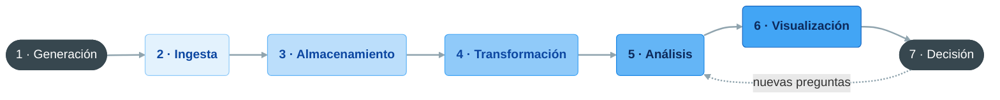

# Presentación del curso: ecosistema y ciclo de vida del dato

**Bloque 1 -- Fundamentos de Data Analytics | Sesión 1 de 3**

[← Volver al índice del curso](../README.md#bloque-1--fundamentos-de-data-analytics)

---

## 1. Introducción

En el bloque 0 preparamos el puesto de trabajo: terminal, Git, VS Code, Markdown, Python y PostgreSQL. A partir de ahora trabajamos **con datos de negocio**, y antes de tocar una sola herramienta necesitamos un mapa: qué es exactamente el análisis de datos, qué recorrido hace un dato desde que se genera hasta que alguien decide algo con él, quién interviene en cada tramo y dónde encaja cada bloque del curso.

El bloque 1 tiene tres sesiones, y son las únicas del curso sin una herramienta específica. Lo que aprenderemos aquí es el vocabulario que usaremos en todas las demás:

**1.1.1 · Presentación, ecosistema y ciclo de vida del dato (esta sesión).** Qué es y qué no es el Data Analytics, las fases por las que pasa un dato, los roles de un equipo de datos y el mapa de herramientas del curso.

**1.1.2 · Variables, dimensiones, medidas y KPIs.** Cómo se clasifica cada columna de un dataset, qué representa cada fila y cómo se define un indicador para que no haya dos versiones del mismo número.

**1.1.3 · Tipos de análisis.** Descriptivo, diagnóstico, predictivo y prescriptivo: qué pregunta responde cada uno y cómo se pasa de "las ventas han caído" a "sabemos por qué y qué hacer".

### Objetivos de la sesión
- Entender qué es el Data Analytics y qué no es.
- Conocer las siete fases del ciclo de vida del dato, de la fuente a la decisión.
- Identificar los roles de un equipo de datos y qué hace cada uno.
- Situar cada bloque y cada herramienta del curso en el ciclo de vida.
- Reconocer por qué fracasan la mayoría de los proyectos de datos.
- Conocer el caso del bloque, Café Lumen, y documentar su ciclo de vida del dato en el portfolio.

### Prerequisitos
- Bloque 0 completado: el portfolio `mi-portfolio-data-analytics` está en GitHub y lo abrimos con VS Code.
- La extensión **Rainbow CSV** instalada (sesión 0.1.3).

---

## 2. El caso conductor: Café Lumen

En cada bloque del curso trabajaremos con una empresa ficticia distinta. La del bloque 1 es **Café Lumen**, una cadena de cafeterías de especialidad con cuatro locales:

| Código | Tienda | Ciudad | Ubicación | Abierta desde |
|:---:|---|---|---|---|
| `MAD` | Lumen Sol | Madrid | Calle comercial | 2019 |
| `BCN` | Lumen Gràcia | Barcelona | Barrio residencial | 2021 |
| `VLC` | Lumen Campus | Valencia | Campus universitario | 2022 |
| `SVQ` | Lumen Santa Justa | Sevilla | Estación de tren | 2023 |

Cuatro locales, cuatro clientelas distintas: oficinistas en Madrid, vecinos que desayunan con calma el fin de semana en Barcelona, estudiantes en Valencia y viajeros con prisa en Sevilla. En enero de 2025 la empresa lanzó una **app de pedidos y fidelización**: el cliente pide desde el móvil, recoge en barra sin hacer cola y acumula puntos.

### El encargo

Café Lumen lleva años registrando cada venta en el TPV (el terminal punto de venta, la caja registradora), pero las decisiones se siguen tomando por intuición. La directora de operaciones, Elena Ruiz, nos ha contratado como analistas con tres preguntas:

1. **¿Cómo vamos?** Qué indicadores debería mirar la dirección cada mes y cómo se calculan.
2. **¿Por qué junio fue peor que mayo?** Las ventas bajaron y nadie sabe explicar por qué.
3. **¿Está funcionando la app?** Seis meses después del lanzamiento, ¿merece la pena seguir invirtiendo en ella?

Para responder, el equipo de sistemas nos ha pasado un extracto de datos del primer semestre de 2025:

| Archivo | Qué contiene | Filas |
|---|---|--:|
| `ventas.csv` | Las ventas de las cuatro tiendas y de la app, de enero a junio de 2025 | 80.874 |
| `tiendas.csv` | Las características de cada local | 4 |
| `productos.csv` | La carta, con precio de venta y coste | 22 |
| `objetivos_mensuales.csv` | El objetivo de ventas que la dirección fijó para cada tienda y mes | 24 |

Los datos están en la carpeta [`dataset/`](dataset/) de este bloque. Hoy solo los descargamos y les echamos un vistazo; en la 1.1.2 los estudiaremos columna a columna.

---

## 3. ¿Qué es y qué no el Data Analytics?

**El Data Analytics es el proceso de examinar datos para extraer conclusiones que apoyen decisiones.** No consiste en hacer gráficos bonitos ni en llenar dashboards de números: consiste en **reducir la incertidumbre antes de decidir**.

Lo que diferencia a una organización que usa datos de una que no los usa no es la cantidad de datos que tiene. Café Lumen tiene decenas de miles de ventas registradas y sigue decidiendo a ojo. La diferencia está en la capacidad de **convertir esos datos en preguntas respondidas**.

| Qué es | Qué no es |
|---|---|
| Transformar datos brutos en información accionable | Acumular datos "por si acaso" |
| Responder preguntas de negocio con evidencia cuantitativa | Hacer un dashboard que nadie consulta |
| Apoyar decisiones que antes se tomaban por intuición | Automatizar un informe que ya era inútil en papel |
| Empezar por la pregunta y buscar los datos que la responden | Empezar por los datos y esperar a que "digan algo" |

### Dato, información, conocimiento, decisión

Es útil distinguir cuatro niveles, porque el trabajo del analista consiste en subir por ellos:

| Nivel | Ejemplo en Café Lumen |
|---|---|
| **Dato** | "Ticket T000010: un café con leche y un croissant, 3,80 €, 2 de enero a las 08:17, Madrid." |
| **Información** | "En enero, las bebidas frías fueron el 5 % de las ventas; en junio, el 27 %." |
| **Conocimiento** | "Con el calor, los clientes cambian el café caliente por bebidas frías, y el cambio empieza en abril." |
| **Decisión** | "La carta de verano entra en abril, con más variedad de bebidas frías y stock de hielo reforzado." |

Un dato aislado no sirve para nada. Agregado, se convierte en información. Comparado y explicado, en conocimiento. Y solo tiene valor si alguien actúa en consecuencia.

### La frase clave

> Un análisis no empieza con los datos, sino con una pregunta de negocio. Si al terminar nadie decide nada distinto, no hemos hecho análisis: hemos hecho aritmética.

---

## 4. El ciclo de vida del dato

El dato recorre un camino desde que se genera hasta que alguien toma una decisión basándose en él. Ese camino tiene siete fases:

| Fase | Qué ocurre | Quién interviene |
|---|---|---|
| **1. Generación** | El dato se crea: una venta, un formulario, un sensor, un clic | Sistemas y procesos de negocio |
| **2. Ingesta** | El dato se captura y se mueve al entorno analítico | Ingeniería de datos |
| **3. Almacenamiento** | El dato se guarda en un formato estructurado y accesible | Ingeniería de datos, administración de bases de datos |
| **4. Transformación** | El dato se limpia, se estructura y se enriquece | Ingeniería de datos, analistas |
| **5. Análisis** | Se extraen patrones, tendencias y conclusiones | Analistas, científicos de datos |
| **6. Visualización y comunicación** | Los resultados se presentan de forma comprensible | Analistas, desarrolladores de BI |
| **7. Decisión** | Alguien actúa a partir de lo analizado | Negocio |



> El ciclo no es lineal. Casi siempre, una decisión genera preguntas nuevas que obligan a volver al análisis y, a veces, a pedir datos que todavía no se están recogiendo.

### El ciclo en Café Lumen

1. **Generación.** Cada vez que un cliente paga, el TPV de la tienda registra qué productos lleva, cuántos, a qué precio y a qué hora. La app registra además quién es el cliente y, si la deja, su valoración del pedido.
2. **Ingesta.** Cada noche, el TPV de cada local envía el cierre del día al servidor central del proveedor del TPV. Los pedidos de la app ya viven en la nube de otro proveedor.
3. **Almacenamiento.** Hoy los datos están repartidos en tres sitios: la base de datos del TPV, la de la app y un Excel donde la dirección financiera apunta los objetivos mensuales.
4. **Transformación.** Alguien tiene que unir las ventas del TPV y las de la app en una sola tabla, con los mismos códigos de tienda y de producto. El extracto `ventas.csv` que hemos recibido es precisamente el resultado de ese trabajo.
5. **Análisis.** Aquí entramos nosotros: ¿qué pasó en junio?, ¿qué aporta la app?
6. **Visualización.** Un informe mensual de una página y, más adelante, un dashboard para la dirección.
7. **Decisión.** Ajustar horarios, cambiar la carta de verano, decidir si se sigue invirtiendo en la app.

Fijémonos en un detalle: **el extracto que hemos recibido llega en la fase 4**. Alguien ya hizo la ingesta, el almacenamiento y buena parte de la transformación. Es lo habitual para un analista. Por eso conviene preguntar siempre de dónde vienen los datos y qué se les ha hecho por el camino: si la transformación tuvo un error, todo lo que construyamos encima lo heredará.

---

## 5. Roles en un equipo de datos

En una empresa mediana o grande, el ciclo de vida se reparte entre varios perfiles. Conocerlos sirve para saber a quién preguntar y dónde acaba nuestro trabajo.

| Rol | Responsabilidad principal | Fases del ciclo | Herramientas habituales |
|---|---|:---:|---|
| **Data Architect** | Diseñar cómo se organizan, integran y almacenan los datos de la empresa: modelos, plataformas y estándares | 2, 3 | Modelado de datos, data warehouse y data lake, cloud |
| **Data Engineer** | Construir y mantener los flujos que mueven y almacenan los datos | 2, 3, 4 | SQL, Python, Spark, Airflow, cloud |
| **Analytics Engineer** | Transformar los datos almacenados en tablas limpias y documentadas, listas para analizar | 4 | SQL, dbt |
| **Data Analyst** | Convertir datos en respuestas a preguntas de negocio | 4, 5, 6 | SQL, Excel, Python, Power BI, Tableau |
| **BI Developer** | Diseñar y mantener cuadros de mando e informes corporativos | 6 | Power BI, Tableau, Qlik |
| **Data Scientist** | Construir modelos estadísticos y de machine learning | 5 | Python, R, Jupyter |
| **Data Steward** | Velar por la calidad, la definición y el buen uso de los datos de su área | Todas | Catálogos de datos, herramientas de calidad |
| **Negocio** (*data owner*) | Plantear las preguntas, validar las definiciones y decidir | 7 (y 1) | Informes y dashboards |

El Data Architect y el Data Engineer se confunden a menudo: el arquitecto diseña el sistema y el ingeniero lo construye y lo mantiene. En empresas medianas suele ser la misma persona.

> En equipos pequeños, y en este curso, el analista asume tareas de varios roles: prepara datos como un ingeniero, construye dashboards como un desarrollador de BI y entrena algún modelo sencillo como un científico de datos. Es lo normal al empezar, y es lo que hace valioso a un buen analista: entiende el ciclo completo.

En Café Lumen no hay equipo de datos: estamos nosotros, el proveedor del TPV (que hace de arquitectura e ingeniería de datos sin saberlo) y Elena Ruiz, que representa a negocio.

---

## 6. El ecosistema de herramientas

Las herramientas son el medio, no el fin. Lo que hace bueno un análisis no es la herramienta que se usó, sino la pregunta que respondió. Aun así, cada herramienta tiene su sitio en el ciclo de vida, y el curso está organizado siguiendo ese recorrido:


*B = bloque del curso. El gobierno del dato (Bloque 5) es transversal a todas las fases.*

| Herramienta | Fase principal | Cuándo elegirla |
|---|---|---|
| **SQL** | Almacenamiento, transformación y consulta | Siempre que los datos vivan en una base de datos relacional, que es casi siempre |
| **Python** | Transformación y análisis | Datos voluminosos, procesos que se repiten, estadística y modelos |
| **Excel** | Análisis y visualización | Datasets pequeños, trabajo individual, prototipos rápidos |
| **Power BI, Tableau, Qlik Sense** | Visualización y cuadros de mando | Informes recurrentes, datos que se actualizan, muchos usuarios |

Las tres herramientas de BI del curso hacen prácticamente lo mismo. Tabajaremos las tres porque el mercado laboral las demanda, y porque ver cómo resuelven el mismo problema de tres formas distintas ayuda a entender el problema.

---

## 7. Por qué fracasan los proyectos de datos

La mayoría de los proyectos de datos no fracasan por razones técnicas, sino de negocio:

| Causa | Qué pasa |
|---|---|
| **Pregunta mal definida** | El análisis responde algo, pero no lo que el negocio necesitaba saber |
| **Datos de mala calidad** | Los resultados son incorrectos y nadie lo detecta hasta que el daño está hecho |
| **Resultado no comunicado** | El análisis es correcto, pero nadie en negocio lo entiende o lo usa |
| **Sin responsable en negocio** | Nadie valida los indicadores ni actúa sobre los resultados |
| **Herramienta equivocada** | Una herramienta compleja para un problema sencillo, o al revés |

Fijémonos en que cada causa rompe una fase distinta del ciclo: la pregunta mal definida rompe la fase 7 antes de empezar, la mala calidad rompe las fases 1 a 4, y la falta de comunicación rompe la fase 6. Un buen analista vigila el ciclo entero, no solo su tramo.

---

## 8. Práctica: primer contacto con los datos de Café Lumen

Vamos a descargar los datos del bloque, verlos por dentro y documentar el ciclo de vida del dato de Café Lumen.

### Del TPV al CSV: qué es un extracto

Cuando decimos que el equipo de sistemas "nos ha pasado los datos", conviene entender qué ha ocurrido por debajo, porque explica muchas de las rarezas que encontraremos.

El TPV y la app son **sistemas operacionales**: están diseñados para registrar operaciones una a una, muy deprisa y sin errores. Guardan cada venta en el momento en que se produce, en una base de datos optimizada para **escribir**. No están pensados para responder preguntas como "¿cuánto vendimos por tienda y mes?", que obligan a **leer** millones de registros de golpe.

Por eso los datos se **extraen**: alguien lanza una consulta sobre esos sistemas, une el resultado y lo guarda en un formato portable. Nuestro `ventas.csv` es eso, una **fotografía** de los datos en un momento dado, con tres consecuencias:

- **No se actualiza solo.** Si mañana se anula una venta de junio, nuestro CSV no se entera. En el bloque 5 veremos cómo las empresas resuelven esto con un *data warehouse*, un almacén que se alimenta de forma automática y periódica.
- **Refleja las decisiones de quien lo extrajo.** Qué columnas incluir, cómo llamarlas, qué hacer con los tickets anulados: todo eso lo decidió otra persona. Por eso preguntamos.
- **CSV es texto plano.** Un archivo CSV (*comma-separated values*) es una tabla escrita como texto: una fila por línea, columnas separadas por comas. No guarda tipos de datos: `2025-01-02` es texto hasta que una herramienta decide interpretarlo como fecha, y `2.00` es texto hasta que decide que es un número. Esa interpretación es fuente de errores, como veremos en la sección 10.

### Paso 1: descargar los datos

Entramos en la carpeta [`dataset/`](dataset/) de este bloque en GitHub. Abrimos cada uno de los cuatro archivos (`ventas.csv`, `tiendas.csv`, `productos.csv` y `objetivos_mensuales.csv`) y pulsamos el botón **Download raw file** (la flecha hacia abajo, arriba a la derecha).

Guardamos los cuatro en una carpeta nueva del portfolio: `practicas/bloque-01/dataset/`.

### Paso 2: ver los datos

Abrimos el portfolio en VS Code y, desde el explorador, hacemos clic en `ventas.csv`. Gracias a **Rainbow CSV**, cada columna aparece de un color distinto, y al pasar el ratón por un valor vemos el nombre de su columna. Las primeras líneas son así:

```
linea_id,ticket_id,fecha,hora,tienda_id,canal,cliente_id,producto_id,producto,categoria,cantidad,precio_unitario,descuento_pct,importe,estado_ticket,valoracion_ticket
L000001,T000001,2025-01-02,07:07,MAD,Para llevar,,P02,Americano,Café,1,1.80,0,1.80,Completado,
L000002,T000002,2025-01-02,07:15,MAD,Local,C00072,P05,Flat white,Café,1,3.00,0,3.00,Completado,
```

La primera línea es la **cabecera**, con el nombre de cada columna; cada línea siguiente es un registro. El archivo tiene 80.874 registros: basta con bajar hasta el final (`Ctrl + End`) y mirar el número de la última línea, que es 80.875 porque incluye la cabecera.

Abrimos también los otros tres archivos. Sin entrar en detalle (es el tema de la próxima sesión), anotamos las primeras impresiones:

- ¿Qué columnas tiene cada archivo y qué parece contener cada una?
- ¿Hay celdas vacías? Por ejemplo, en `cliente_id` o en `valoracion_ticket`.
- ¿Qué columnas aparecen en varios archivos? `tienda_id` y `producto_id` son la pista de cómo se relacionan las tablas.
- ¿Qué valores toman columnas como `canal` o `estado_ticket`?

### Paso 3: documentar el ciclo de vida

Creamos `practicas/bloque-01/1.1.1-ciclo-de-vida.md` y lo completamos a partir de esta plantilla:

````markdown
# Café Lumen: ciclo de vida del dato

**Bloque 1 · Sesión 1.1.1** · <fecha>

## Contexto

<Dos o tres frases: qué es Café Lumen y qué nos ha pedido la dirección.>

## Datos recibidos

| Archivo | Qué contiene | Filas |
|---|---|--:|
| `ventas.csv` | | |
| `tiendas.csv` | | |
| `productos.csv` | | |
| `objetivos_mensuales.csv` | | |

## Ciclo de vida


| Fase | En Café Lumen | Responsable |
|---|---|---|
| 1. Generación | | |
| 2. Ingesta | | |
| 3. Almacenamiento | | |
| 4. Transformación | | |
| 5. Análisis | | |
| 6. Visualización | | |
| 7. Decisión | | |

## Primeras observaciones

- <Qué nos ha llamado la atención al abrir los archivos.>

## Preguntas para el equipo de sistemas

- <Qué necesitaríamos saber sobre cómo se generaron los datos.>
````

La sección **Preguntas para el equipo de sistemas** es la más importante. Algunas ideas para empezar: ¿qué significa que un ticket esté "Anulado"?, ¿por qué hay filas sin `cliente_id`?, ¿el importe lleva IVA?, ¿los objetivos se fijaron antes o después de empezar cada mes?

---

## 9. Ejercicios

**Ejercicio 1: roles en un equipo de datos.** Un banco está construyendo un sistema de alertas tempranas de impago con cuatro personas. Asigna un rol a cada una y justifica la elección:

- **Persona A:** diseña los flujos que extraen cada hora los movimientos de las cuentas y los cargan en el sistema analítico.
- **Persona B:** estudia qué comportamientos (retrasos en recibos, caídas de saldo) preceden a un impago y construye un modelo que los detecta.
- **Persona C:** construye el dashboard que el equipo de riesgos consulta cada mañana.
- **Persona D:** define qué datos de clientes pueden usarse para el análisis y en qué condiciones, en cumplimiento del RGPD.

<details>
<summary>Ver la solución</summary>

A es **Data Engineer** (ingesta y almacenamiento, fases 2 y 3). B es **Data Scientist** (análisis con modelos predictivos, fase 5). C es **BI Developer** (visualización, fase 6). D es **Data Steward** (gobierno y uso correcto de los datos, transversal).

</details>

**Ejercicio 2: ¿dónde falla este proyecto?** Identifica la causa principal de fracaso de la sección 7 en cada escenario:

- **A.** Una tienda online dedica seis meses a un modelo que predice el abandono del carrito con un 84 % de acierto. Al presentarlo, marketing pregunta: "¿Y esto cómo nos dice qué email enviar?".
- **B.** El director financiero pide un informe de rentabilidad por producto. Recibe un Excel con 12 pestañas y 47 métricas, lo cierra y llama por teléfono para preguntar cuál es el producto menos rentable.
- **C.** Una clínica pone en marcha un dashboard de tiempos de espera por especialidad. Tres meses después nadie lo consulta, porque los datos salen de un sistema que los médicos no actualizan con regularidad.

<details>
<summary>Ver la solución</summary>

**A:** pregunta mal definida. El modelo responde "quién abandonará", pero marketing necesitaba saber "qué hacer con cada cliente". **B:** resultado no comunicado. El análisis quizá es correcto, pero no responde a la pregunta de forma directa. **C:** datos de mala calidad, que nacen en la fase 1 (generación). Ningún dashboard arregla un dato que no se registra bien.

</details>

**Ejercicio 3: tu propio ciclo.** Elige una organización que conozcas (tu empresa, un comercio del barrio, un hospital, una plataforma de música) y responde en un párrafo: qué datos genera en su día a día, dónde crees que los guarda, qué pregunta de negocio podrían responder y en qué fase del ciclo se quedan hoy esos datos.

---

## 10. Errores comunes y troubleshooting

**1. "Al abrir `ventas.csv` con doble clic, Excel lo muestra todo en una sola columna."** Excel en español espera el punto y coma como separador, porque la coma es nuestro separador decimal. En lugar del doble clic usamos **Datos > Obtener datos > De texto/CSV**, elegimos **Delimitador: Coma** y, en **Transformar datos**, fijamos la configuración regional *Inglés (Estados Unidos)* para que `2.00` se lea como dos euros. Lo veremos a fondo en el bloque 6; para este bloque basta con VS Code y Rainbow CSV.

**2. "Las tildes salen como `Café`."** El archivo está en UTF-8 y el programa lo lee con otra codificación. En Excel elegimos **Origen del archivo: 65001: Unicode (UTF-8)** al importar. En VS Code no debería pasar; si pasa, pulsamos sobre la codificación en la barra de estado (abajo a la derecha) → **Reopen with Encoding** → **UTF-8**.

**3. "El diagrama Mermaid no se dibuja en la vista previa de VS Code."** La vista previa de VS Code necesita una extensión para Mermaid (por ejemplo, *Markdown Preview Mermaid Support*). GitHub lo dibuja sin nada más. Comprobamos también que el bloque empieza exactamente por tres comillas invertidas y la palabra `mermaid`.

**4. "El navegador abre el CSV como texto en lugar de descargarlo."** Si al pulsar sobre el archivo en GitHub vemos el texto en una página, usamos el botón **Download raw file**; si ya estamos en la página de texto plano, clic derecho → **Guardar como...** y comprobamos que el nombre termina en `.csv` y no en `.csv.txt`.

**5. "Confundo el ciclo de vida del dato con las fases de un proyecto."** El ciclo de vida describe el **recorrido del dato**: de la fuente a la decisión. Un proyecto de análisis tiene sus propias fases (entender la pregunta, preparar los datos, analizar, presentar), que viven sobre todo en las fases 4 a 7 del ciclo. En *Para profundizar* veremos CRISP-DM, la metodología de proyecto más conocida.

---

## 11. Conclusión

En esta sesión hemos definido el Data Analytics como el proceso que reduce la incertidumbre antes de decidir y hemos distinguido dato, información, conocimiento y decisión. Hemos recorrido las siete fases del ciclo de vida del dato, desde la generación hasta la decisión, con los roles que intervienen en cada una, y hemos situado cada bloque del curso en ese mapa. También hemos visto que la mayoría de los proyectos fracasan por razones de negocio, no técnicas. Con todo ello hemos conocido Café Lumen, hemos descargado su extracto de datos del primer semestre de 2025 y hemos dejado en el portfolio `practicas/bloque-01/1.1.1-ciclo-de-vida.md`, con el ciclo de vida de la empresa y las preguntas que haríamos al equipo de sistemas. En la 1.1.2 abriremos esos archivos columna a columna para entender qué representa cada fila y definiremos los indicadores que la dirección necesita.

---

## 12. Para profundizar

### CRISP-DM: la metodología clásica de un proyecto de datos

**CRISP-DM** (*Cross-Industry Standard Process for Data Mining*, 1999) sigue siendo la metodología de referencia para organizar un proyecto de análisis. Tiene seis fases que se repiten en ciclo: **comprensión del negocio**, **comprensión de los datos**, **preparación de los datos**, **modelado**, **evaluación** y **despliegue**. Su mayor acierto es empezar por el negocio y no por los datos, y reconocer que se vuelve atrás constantemente: la preparación de los datos suele llevar más de la mitad del tiempo del proyecto.

### Data-driven frente a data-informed

Se habla mucho de empresas *data-driven* (guiadas por los datos). Muchos profesionales prefieren *data-informed* (informadas por los datos): los datos informan la decisión, pero no la toman solos. El contexto, la estrategia y el sentido común siguen pesando. Un buen analista sabe cuándo los datos son concluyentes y cuándo solo apuntan en una dirección.

### El Analytics Engineer y el *modern data stack*

El rol de **Analytics Engineer** apareció hacia 2019, a medio camino entre la ingeniería de datos y el análisis. Su herramienta emblemática es **dbt**, que permite escribir las transformaciones como consultas SQL versionadas con Git, probadas y documentadas, igual que el código. Es un buen ejemplo de cómo las prácticas del bloque 0 (Git, Markdown, revisión con pull requests) se han trasladado al mundo del dato.

### OLTP y OLAP

Los sistemas operacionales como el TPV se llaman **OLTP** (*Online Transaction Processing*): muchas escrituras pequeñas y rápidas. Los sistemas analíticos se llaman **OLAP** (*Online Analytical Processing*): pocas lecturas, pero enormes. Son dos formas distintas de organizar los datos, y el paso de una a otra es el núcleo del bloque 5 (arquitectura de datos) y del modelado en estrella que veremos en Power BI.

---

## 13. Recursos

- **CRISP-DM**, las seis fases y su historia: <https://es.wikipedia.org/wiki/Cross_Industry_Standard_Process_for_Data_Mining>
- **Google Data Analytics Professional Certificate**, primer curso ("Foundations: Data, Data, Everywhere"): <https://www.coursera.org/professional-certificates/google-data-analytics>
- **What is analytics engineering?** (dbt Labs): <https://www.getdbt.com/blog/what-is-analytics-engineering>
- **Rainbow CSV**, documentación de la extensión: <https://marketplace.visualstudio.com/items?itemName=mechatroner.rainbow-csv>
- **Mermaid: diagramas de flujo**: <https://mermaid.js.org/syntax/flowchart.html>

---

*Guía del alumno · Sesión 1 · Bloque 1 - Fundamentos de Data Analytics · Café Lumen*
