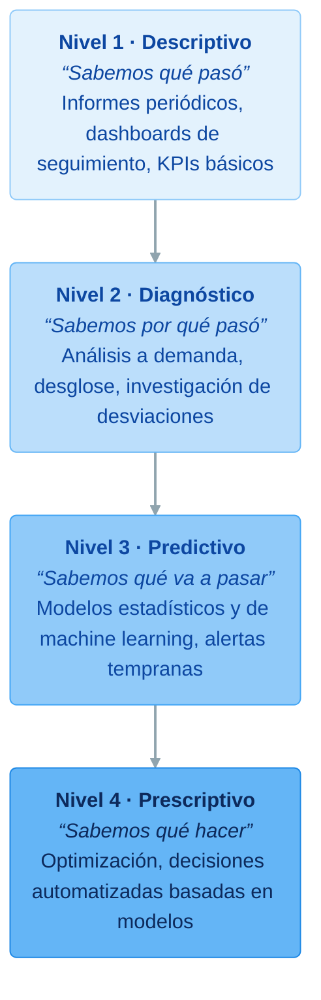

# Tipos de análisis: descriptivo, diagnóstico, predictivo y prescriptivo

**Bloque 1 -- Fundamentos de Data Analytics | Sesión 3 de 3**

[← Volver al índice del curso](../README.md#bloque-1--fundamentos-de-data-analytics)

---

## 1. Introducción

Ya conocemos el ciclo de vida del dato y sabemos leer un dataset: tipos de variables, dimensiones, medidas, granularidad y KPIs. Nos quedan dos preguntas del encargo de Café Lumen: **¿por qué junio fue peor que mayo?** y **¿está funcionando la app?**

Las dos parecen del mismo estilo, pero no lo son. La primera pide una **explicación** de algo que ya ha pasado. La segunda pide un **juicio** que, bien hecho, obliga a estimar qué habría pasado sin la app y qué pasará si se sigue invirtiendo en ella. Cada pregunta de negocio pide un **tipo de análisis** distinto, y reconocerlo antes de empezar ahorra semanas de trabajo en la dirección equivocada.

Esta sesión cierra el bloque 1. Al terminarla, el portfolio tendrá un informe de una página para la dirección de Café Lumen con la respuesta a la pregunta de junio, basado en datos.

### Objetivos de la sesión
- Conocer los cuatro tipos de análisis y la pregunta que responde cada uno.
- Hacer un análisis diagnóstico completo: de la cifra global a la causa, descomponiendo por dimensiones.
- Saber qué necesitan el análisis predictivo y el prescriptivo, y reconocer cuándo los datos no bastan.
- Entender la madurez analítica como un camino progresivo.
- Elegir el tipo de análisis adecuado para cada pregunta de negocio.
- Redactar un informe breve para la dirección con conclusiones y recomendaciones.

### Prerequisitos
- Sesiones 1.1.1 y 1.1.2 completadas: diccionario de datos y fichas de KPI de Café Lumen en el portfolio.

---

## 2. Los cuatro tipos de análisis

La clasificación más extendida en el ámbito profesional, popularizada por la consultora Gartner, distingue cuatro tipos de análisis según la pregunta que responden:

| Tipo | Pregunta | Dificultad | Valor para el negocio |
|---|---|:---:|:---:|
| **Descriptivo** | ¿Qué ha pasado? | Baja | Moderado |
| **Diagnóstico** | ¿Por qué ha pasado? | Media | Alto |
| **Predictivo** | ¿Qué va a pasar? | Alta | Muy alto |
| **Prescriptivo** | ¿Qué deberíamos hacer? | Muy alta | Máximo |

Cada nivel se apoya en el anterior. No tiene sentido predecir las ventas del próximo trimestre si todavía no sabemos calcular bien las del pasado; ni recomendar una acción sin entender por qué ocurren las cosas.

---

## 3. Análisis descriptivo: ¿qué ha pasado?

El análisis descriptivo **resume** lo que muestran los datos. Es el punto de partida de cualquier proyecto y, en la práctica, la mayor parte del trabajo diario de un analista: informes mensuales, dashboards de seguimiento, KPIs.

**Técnicas habituales:** agregaciones (sumas, recuentos, medias), comparaciones entre grupos, evolución en el tiempo, estadísticos descriptivos (media, mediana, dispersión) y distribuciones.

**Herramientas:** SQL, Excel y tablas dinámicas, pandas y cualquier herramienta de BI.

### Café Lumen: el primer semestre

Aplicamos las definiciones de la 1.1.2: ventas netas (sin anulados) y ticket medio (ventas entre tickets distintos).

| Mes | Ventas netas | Tickets | Ticket medio |
|---|--:|--:|--:|
| Enero | 37.204 € | 7.522 | 4,95 € |
| Febrero | 36.033 € | 7.357 | 4,90 € |
| Marzo | 39.875 € | 8.112 | 4,92 € |
| Abril | 39.484 € | 7.886 | 5,01 € |
| Mayo | 43.533 € | 8.496 | 5,12 € |
| Junio | 41.016 € | 7.945 | 5,16 € |

Esta tabla ya responde a "¿qué ha pasado?": **en junio las ventas bajaron 2.517 € respecto a mayo, un 5,8 %**, con menos tickets pero un ticket medio algo mayor. Es lo que ve la dirección y lo que la preocupa. Pero no explica nada: para eso necesitamos el siguiente nivel.

---

## 4. Análisis diagnóstico: ¿por qué ha pasado?

El análisis diagnóstico **investiga las causas**. Su técnica principal es el **desglose** (*drill-down*): descomponer la cifra global por las dimensiones disponibles hasta encontrar dónde se concentra la variación. Después, formular hipótesis y buscar datos que las confirmen o las descarten.

**Técnicas habituales:** desglose por dimensiones, comparación de grupos, análisis de la variación, correlación, estudio de valores atípicos.

**Herramientas:** SQL, tablas dinámicas, pandas, y los filtros y la navegación jerárquica de las herramientas de BI.

### La investigación de junio, paso a paso

**Paso 1: ¿Afecta a todas las tiendas?** Desglosamos por la dimensión `tienda_id`:

| Tienda | Mayo | Junio | Variación | % |
|---|--:|--:|--:|--:|
| MAD | 13.568,08 € | 13.756,98 € | +188,90 € | +1,4 % |
| BCN | 10.690,61 € | 11.213,41 € | +522,80 € | +4,9 % |
| VLC | 7.436,95 € | 4.319,93 € | **−3.117,02 €** | **−41,9 %** |
| SVQ | 11.837,74 € | 11.725,76 € | −111,98 € | −0,9 % |
| **Total** | **43.533,38 €** | **41.016,08 €** | **−2.517,30 €** | **−5,8 %** |

Primer hallazgo, y el más importante: **Valencia pierde más de lo que pierde la empresa entera**. Sin Lumen Campus, las otras tres tiendas juntas **crecen un 1,7 %** en junio. La pregunta ya no es "¿por qué cayó Café Lumen?", sino "¿qué le pasó a Lumen Campus?".

Este desglose funciona porque las ventas son una medida **aditiva** (1.1.2): las variaciones de las cuatro tiendas suman exactamente la variación total. Con el ticket medio no podríamos hacerlo, porque no es aditivo.

**Paso 2: ¿Cuándo, dentro del mes?** Desglosamos las ventas de Valencia por quincenas y las pasamos a ventas por día, porque los tramos tienen distinta duración:

| Tramo | Ventas | Días | Ventas por día |
|---|--:|--:|--:|
| 1 a 15 de mayo | 3.579,84 € | 15 | 239 € |
| 16 a 31 de mayo | 3.857,11 € | 16 | 241 € |
| 1 a 13 de junio | 3.250,94 € | 13 | 250 € |
| 14 a 30 de junio | 1.068,99 € | 17 | **63 €** |

No es un descenso gradual: es un **corte brusco a mediados de junio**. Hasta el día 13, Valencia vendía como siempre; desde el 14, una cuarta parte.

**Paso 3: Formular hipótesis.** Lumen Campus está en un campus universitario. La hipótesis evidente es que **terminaron las clases y los exámenes**. Antes de darla por buena, buscamos más pruebas en los datos:

- **Fines de semana.** Un día laborable, Valencia atiende de media unos 52 tickets; un sábado o un domingo, unos 12. Su clientela depende del calendario lectivo. Ninguna otra tienda muestra ese patrón: Barcelona vende más el fin de semana y Sevilla, igual todos los días.
- **Abril.** Valencia ya tuvo una caída en abril (5.713 € frente a 6.646 € en marzo), coincidiendo con las vacaciones de Pascua.
- **El objetivo.** La dirección fijó para Valencia un objetivo de 4.500 € en junio, frente a 7.300 € en mayo: **ya sabía que junio sería flojo**. El cumplimiento fue del 96,0 %.

Todas las pruebas apuntan en la misma dirección. Pero fijémonos en que la causa (el calendario universitario) **no está en nuestros datos**: la deducimos por coherencia y la confirmaríamos con el calendario académico de la universidad. Es lo normal en un diagnóstico: los datos señalan dónde mirar y el conocimiento del negocio completa la explicación.

**Paso 4: ¿Hay algo más?** Desglosamos también por categoría, para asegurarnos de que no se nos escapa otro efecto:

| Categoría | Mayo | Junio | Variación |
|---|--:|--:|--:|
| Café | 15.760,74 € | 12.271,26 € | −3.489,48 € |
| Bebidas frías | 8.348,88 € | 11.111,29 € | +2.762,41 € |
| Salado | 10.690,76 € | 9.789,43 € | −901,33 € |
| Bollería | 6.040,51 € | 5.460,34 € | −580,17 € |
| Té e infusiones | 2.692,49 € | 2.383,76 € | −308,73 € |

El café cae mucho, pero las bebidas frías compensan casi todo: es un **cambio de mezcla** por el calor, no una pérdida de clientes. Como las bebidas frías son más caras que un café con leche, esto explica también que el **ticket medio suba** mientras bajan las ventas. No es un problema, pero sí una información útil para la carta de verano y para las compras (hielo, leche, vasos).

**Conclusión diagnóstica.** La caída de junio (−5,8 %) se debe al cierre del curso universitario, que redujo las ventas de Lumen Campus en tres cuartas partes a partir del 14 de junio. Es un efecto estacional **previsto** en el objetivo. El resto de la cadena crece un 1,7 %, con un fuerte desplazamiento del café hacia las bebidas frías.

### Una lección de método

Comparar un mes con el anterior es la comparación más habitual y, a menudo, la más engañosa: mezcla la tendencia del negocio con los efectos del calendario (festivos, vacaciones, fiestas locales como la Feria de Abril de Sevilla, que infló sus ventas de mayo). Las comparaciones más informativas son **contra el objetivo** y **contra el mismo periodo del año anterior**. Café Lumen no nos ha dado datos de 2024: lo anotamos como petición.

---

## 5. Análisis predictivo: ¿qué va a pasar?

El análisis predictivo usa patrones históricos para **estimar lo que ocurrirá**. No predice con certeza: da estimaciones con un margen de error o probabilidades.

**Técnicas habituales:** modelos de regresión (estimar un número: las ventas de la próxima semana), de clasificación (estimar una categoría: si un cliente dejará de venir), de series temporales (proyectar una evolución con su estacionalidad) y detección de anomalías.

**Herramientas:** Python con scikit-learn (bloque 4), funciones de previsión de Excel y de las herramientas de BI, y plataformas de *machine learning* en la nube.

| Sector | Pregunta predictiva | Acción que permite |
|---|---|---|
| Restauración | ¿Cuántos clientes tendremos cada hora del próximo lunes? | Planificar turnos y producción de bollería |
| Retail | ¿Qué productos se agotarán antes del fin de semana? | Reponer con antelación |
| Banca | ¿Qué clientes tienen más probabilidad de impago? | Revisar el riesgo de forma preventiva |
| Sanidad | ¿Qué pacientes tienen más riesgo de reingreso? | Seguimiento personalizado tras el alta |
| Telecomunicaciones | ¿Qué clientes darán de baja su línea el próximo mes? | Ofertas de retención |

### ¿Podemos predecir las ventas de Café Lumen en julio?

Con los datos que tenemos, **no con fiabilidad**. Seis meses no contienen ni un solo verano completo: no sabemos cómo se comportan las tiendas en julio y agosto, ni si Valencia cierra, ni cuánto sube la estación de Sevilla con los viajes de vacaciones. Un modelo entrenado con enero-junio extrapolaría la tendencia de primavera y se equivocaría.

> Un modelo predictivo necesita datos históricos que contengan los patrones que queremos predecir, con suficiente volumen y calidad. Un modelo entrenado con datos sucios o incompletos predice con seguridad cosas equivocadas.

---

## 6. Análisis prescriptivo: ¿qué deberíamos hacer?

El análisis prescriptivo **recomienda la mejor acción**. Combina una predicción (qué pasará en cada escenario) con una **optimización** (cuál de los escenarios es mejor según un criterio y unas restricciones).

**Técnicas habituales:** optimización matemática, simulación de escenarios y sistemas de recomendación.

**Herramientas:** Python (librerías de optimización como SciPy o PuLP), herramientas especializadas y, cada vez más, sistemas de IA integrados en los procesos.

**Ejemplo: turnos en Café Lumen.** Un modelo predictivo estima cuántos clientes llegarán cada media hora de la semana siguiente a cada tienda. Un modelo prescriptivo decide **cuántas personas poner en cada turno** para que el tiempo de espera no supere los tres minutos con el menor coste de personal posible, respetando las restricciones laborales (horas máximas, descansos). El resultado no es un gráfico: es un cuadrante de turnos.

**Ejemplo: precios en comercio electrónico.** Un modelo estima que la demanda de un producto cae con fuerza si su precio supera los 12 €. El sistema prescriptivo recalcula cada semana el precio que maximiza el margen sin cruzar ese umbral, y lo aplica automáticamente.

No todo lo prescriptivo requiere modelos. Una recomendación bien fundada en un diagnóstico ("abrir Lumen Campus solo por las mañanas del 14 de junio a septiembre") ya es una prescripción, aunque sea sencilla.

---

## 7. ¿Está funcionando la app? Los cuatro tipos en una misma pregunta

La tercera pregunta del encargo es un buen ejemplo de cómo una sola pregunta de negocio recorre los cuatro niveles, y de dónde se agotan nuestros datos.

**Descriptivo: lo que sabemos.**

| Indicador | Enero | Junio |
|---|--:|--:|
| % de tickets por la app | 5,3 % | 18,1 % |

| Canal | Ticket medio (semestre) |
|---|--:|
| Local | 5,07 € |
| Para llevar | 5,09 € |
| App | 4,51 € |

La app crece todos los meses. En junio fue el único canal que vendió más que en mayo (+6,5 %). Pero su ticket medio es un 11 % menor que el de los otros canales, porque los socios tienen un 10 % de descuento.

**Diagnóstico: lo que no sabemos.** La pregunta clave es si la app **trae ventas nuevas** o si **desplaza** a clientes que antes pedían en barra y ahora lo hacen por la app con descuento. Si es lo segundo, la app reduce los ingresos. Para distinguirlo necesitaríamos el historial de cada cliente antes y después de instalar la app, y la mayoría de las ventas en tienda no tienen `cliente_id`. Con este extracto, **no podemos responder**.

Sí podemos apuntar un tema para investigar: la valoración media de los pedidos por la app en Sevilla es de 3,78 estrellas, frente a entre 4,14 y 4,18 en las otras tres tiendas. ¿Esperas en la recogida?, ¿pedidos incompletos? Es una hipótesis que merece un análisis propio.

**Predictivo y prescriptivo: lo que haría falta.** Estimar qué socios dejarán de usar la app y decidir a quién enviar una oferta para retenerlos requeriría datos de uso de la app (sesiones, notificaciones) y un histórico más largo.

Reconocer lo que los datos **no pueden** responder es tan valioso como responder lo que sí. Un buen informe lo dice con claridad y propone qué datos habría que recoger.

---

## 8. La madurez analítica

Las organizaciones no pasan de "sin datos" a "análisis prescriptivo" de un salto. Recorren un camino de madurez que suele seguir el orden de los cuatro tipos:



Subir un nivel no exige solo técnica: exige **datos** (históricos suficientes y de calidad), **procesos** (alguien que actúe sobre los resultados), **personas** (perfiles capaces) y **herramientas**. La mayoría de las pymes están entre los niveles 1 y 2.

Café Lumen está **antes del nivel 1**: tiene datos, pero nadie los resume de forma sistemática. Nuestro trabajo en este bloque (definir KPIs y explicar la desviación de junio) la lleva a los niveles 1 y 2. El siguiente paso razonable no es un modelo de machine learning, sino un informe mensual fiable y un año de histórico.

---

## 9. Elegir el tipo de análisis adecuado

Antes de empezar, la pregunta más importante es: **¿qué tipo de pregunta está haciendo el negocio?**

| La dirección pregunta... | Tipo | Lo que no debemos hacer |
|---|---|---|
| "¿Cuánto vendimos el mes pasado?" | Descriptivo | Construir un modelo predictivo para responderlo |
| "¿Por qué cayeron las ventas en junio?" | Diagnóstico | Quedarnos en la cifra global sin desglosar |
| "¿Cuántos camareros necesitaremos en agosto?" | Predictivo | Extrapolar a ojo la tendencia de primavera |
| "¿Qué horario de verano deberíamos poner en cada tienda?" | Prescriptivo | Recomendar sin estimar el efecto de cada opción |

> La trampa más frecuente: usar una herramienta sofisticada para una pregunta sencilla, o intentar predecir antes de entender bien lo que ya pasó.

### La frase clave

> Primero se entiende qué pasó, después por qué pasó, y solo entonces se intenta predecir. Y en cada nivel, el análisis termina cuando alguien sabe qué hacer.

---

## 10. Práctica: informe de junio para la dirección

Vamos a escribir el entregable que cierra el bloque: un informe de **una página** para Elena Ruiz con la respuesta a la pregunta de junio. Los números ya los tenemos (secciones 3 y 4); el trabajo está en **seleccionar, ordenar y redactar**.

### Paso 1: escribir el informe

Creamos `practicas/bloque-01/1.1.3-informe-junio.md` con esta estructura:

```markdown
# Café Lumen: ¿por qué bajaron las ventas en junio?

**Para:** Elena Ruiz, directora de operaciones · **De:** <nombre> · <fecha>

## Resumen

<Tres frases como máximo: qué pasó, por qué y si hay que preocuparse. Quien solo lea esto debe quedarse con lo esencial.>

## Qué pasó

<La cifra global de mayo y de junio, con su variación.>

## Por qué

<El desglose por tienda (tabla) y la explicación de Valencia. Una frase sobre el cambio del café a las bebidas frías.>

## Recomendaciones

1. <Qué hacer con Lumen Campus en verano.>
2. <Qué hacer con la carta de verano.>
3. <Qué datos pedir para el próximo análisis.>

## Anexo: definiciones

<Cómo se han calculado las ventas netas y el ticket medio (enlace a las fichas de KPI de la 1.1.2).>
```

Algunas pautas de redacción para cualquier informe dirigido a negocio:

- **La conclusión va primero.** La dirección no necesita revivir la investigación: necesita saber qué pasó y qué hacer. El método va al final o en un anexo.
- **Una tabla, no cinco.** Elegimos la que mejor demuestra la conclusión: aquí, el desglose por tienda.
- **Cifras redondeadas en el texto.** "Valencia vendió un 42 % menos" se lee mejor que "−41,91 %". Los céntimos, solo en las tablas cuando hagan falta.
- **Separar hechos de hipótesis.** "Las ventas de Valencia cayeron un 75 % desde el 14 de junio" es un hecho. "Por el fin del curso universitario" es una explicación muy probable que conviene confirmar.

### Paso 2: cerrar el bloque en el README

Abrimos `README.md` y marcamos el bloque:

```markdown
- [x] Bloque 1 — Fundamentos de Data Analytics
```

La carpeta `practicas/bloque-01/` tiene ya los cuatro documentos del bloque.

---

## 11. Ejercicios

**Ejercicio 1: clasificar preguntas.** Indica el tipo de análisis de cada pregunta y justifícalo en una frase:

1. "¿Cuál fue nuestra cuota de mercado en el segundo trimestre?"
2. "¿Qué clientes tienen más probabilidad de no renovar su suscripción el próximo mes?"
3. "¿Por qué aumentaron las reclamaciones tras el cambio de sistema de atención al cliente?"
4. "¿Qué precio deberíamos fijar para maximizar el margen sin perder cuota?"
5. "¿Cuántos pedidos gestionamos en el Black Friday?"
6. "¿Qué empleados tienen más riesgo de dejar la empresa en los próximos seis meses?"

<details>
<summary>Ver la solución</summary>

1. **Descriptivo:** resume un hecho pasado.
2. **Predictivo:** estima una probabilidad futura para cada cliente.
3. **Diagnóstico:** busca la causa de un cambio observado.
4. **Prescriptivo:** pide la mejor decisión entre varias opciones, con un objetivo (margen) y una restricción (cuota).
5. **Descriptivo:** es un recuento de algo que ya pasó.
6. **Predictivo:** estima un riesgo futuro por empleado. Si además pidiera "qué hacer con cada uno", sería prescriptivo.

</details>

**Ejercicio 2: del descriptivo al diagnóstico.** El informe mensual de una cadena de gimnasios muestra que las bajas de socios de octubre fueron un 35 % superiores a la media del año. Diseña la investigación:

1. ¿Qué tres hipótesis formularías para explicar el aumento?
2. Para cada hipótesis, ¿qué dato concreto la confirmaría o la descartaría?
3. ¿Por qué dimensiones desglosarías primero las bajas?

<details>
<summary>Ver una posible solución</summary>

Hipótesis posibles: (a) un **efecto de calendario**, porque muchos socios se apuntan en septiembre con un contrato de un mes y no renuevan; (b) una **subida de cuota** o un cambio de condiciones en octubre; (c) un **problema en algunos centros**, como la apertura de un competidor o una avería en la climatización. Los datos que las contrastan son, respectivamente: la antigüedad de los socios que se dieron de baja, la fecha de los cambios de tarifa y el desglose de las bajas por centro. El primer desglose sería **por centro** y **por antigüedad del socio**, igual que en Café Lumen empezamos por tienda.

</details>

**Ejercicio 3: madurez analítica.** Piensa en una organización que conozcas. Sitúala en el modelo de madurez y justifícalo; describe qué tendría que cambiar (datos, procesos, personas o herramientas) para subir un nivel, y escribe la primera pregunta de negocio que podría responder en ese nivel nuevo.

**Ejercicio 4: diseñar un plan de análisis.** Una empresa de paquetería quiere reducir las entregas fallidas (el cliente no está en casa o el paquete llega dañado). Diseña el plan en tres fases:

1. **Descriptiva:** ¿qué métricas y qué desgloses construirías primero?
2. **Diagnóstica:** ¿qué relaciones investigarías para entender las causas?
3. **Predictiva y prescriptiva:** ¿qué modelo propondrías y qué acción concreta permitiría?

---

## 12. Lo que hay por debajo: descomponer una variación

El desglose de la sección 4 parece sencillo, pero se apoya en una propiedad matemática que conviene conocer, porque explica cuándo funciona y cuándo engaña.

Cuando una medida es **aditiva**, la variación total es exactamente la suma de las variaciones de cada grupo:

```
−2.517,30 € = +188,90 (MAD) + 522,80 (BCN) − 3.117,02 (VLC) − 111,98 (SVQ)
```

Por eso podemos afirmar que Valencia "explica" más del 100 % de la caída. Con una medida **no aditiva**, como el ticket medio, esto no funciona. El ticket medio de la cadena puede subir aunque baje en todas las tiendas, simplemente porque cambia el peso de cada una en el total. Es el llamado **efecto mezcla**, y su versión extrema tiene nombre propio: la **paradoja de Simpson**, en la que una tendencia que aparece en todos los grupos se invierte al juntarlos.

La consecuencia práctica es que, para explicar una variación del ticket medio, del margen o de cualquier porcentaje, no basta con desglosar: hay que separar cuánto se debe a que **cambian los valores de cada grupo** y cuánto a que **cambia el peso de cada grupo**. Lo trabajaremos con pandas en el bloque 3.

---

## 13. Errores comunes y troubleshooting

**1. "He encontrado la causa en el primer desglose."** Casi nunca es tan sencillo. Después del primer hallazgo, desglosamos por otras dimensiones (tiempo, categoría, canal) para comprobar que no hay un segundo efecto escondido. En junio lo había: el cambio del café a las bebidas frías.

**2. "Los datos demuestran que la causa es el fin de curso."** Los datos muestran un patrón compatible con esa causa. La confirmación viene de fuera (el calendario académico) o de un contraste: si en septiembre, con la vuelta a clase, las ventas se recuperan, la hipótesis se refuerza. **Correlación no implica causalidad** (bloque 3.7).

**3. "He comparado junio con mayo y parece un desastre."** Comparar meses consecutivos mezcla la tendencia con el calendario. Comparamos contra el objetivo y, cuando exista, contra el mismo mes del año anterior.

**4. "He desglosado el ticket medio por tienda y las variaciones no suman la total."** El ticket medio no es aditivo. Desglosamos las ventas y los tickets por separado y recalculamos el cociente en cada grupo.

**5. "Me piden una predicción y solo tengo seis meses de datos."** Lo decimos con claridad y explicamos qué patrones faltan (en este caso, el verano). Una estimación sencilla con un rango amplio y sus supuestos por escrito es más honesta que un modelo sofisticado sin datos suficientes.

**6. "Mi informe tiene todas las tablas que he calculado."** El informe no es un diario de la investigación. Una conclusión, la tabla que la demuestra y las recomendaciones; el resto, al anexo o fuera.

---

## 14. Conclusión

En esta sesión hemos visto los cuatro tipos de análisis y la pregunta que responde cada uno. Con el descriptivo hemos resumido el semestre de Café Lumen y hemos confirmado que en junio las ventas cayeron un 5,8 %. Con el diagnóstico hemos desglosado esa caída hasta su origen: el cierre del curso en Lumen Campus, que se lleva más que la caída total mientras el resto de la cadena crece, y un cambio de mezcla del café a las bebidas frías. Hemos visto qué exigen el análisis predictivo y el prescriptivo, y hemos reconocido que, para saber si la app funciona, nuestros datos no bastan. También hemos situado a Café Lumen en el modelo de madurez analítica. El resultado es `practicas/bloque-01/1.1.3-informe-junio.md`, un informe de una página para la dirección que, junto al ciclo de vida, el diccionario de datos y las fichas de KPI, cierra el bloque 1 en el portfolio. En el bloque 2 dejamos los archivos CSV y pasamos a las bases de datos: con SQL calcularemos nosotros mismos, en segundos, todas las tablas que en este bloque nos han llegado hechas.

---

## 15. Para profundizar

### El modelo de Gartner y sus críticas

Los cuatro tipos de análisis se popularizaron con el *Analytic Ascendancy Model* de Gartner (2012), que los dibuja como una escalera donde cada peldaño aporta más valor y exige más dificultad. La crítica habitual es que sugiere que lo descriptivo "vale poco". En la práctica, un buen análisis descriptivo, fiable y a tiempo, es lo que más valor aporta en la mayoría de las empresas, y los niveles no se abandonan al subir: se acumulan.

### La pirámide DIKW

La progresión dato → información → conocimiento → decisión de la 1.1.1 procede de la **pirámide DIKW** (*Data, Information, Knowledge, Wisdom*), un modelo clásico de la gestión del conocimiento. Los cuatro tipos de análisis encajan en ella: el descriptivo convierte datos en información; el diagnóstico, información en conocimiento; el predictivo y el prescriptivo acercan ese conocimiento a la decisión.

### La paradoja de Simpson

El ejemplo más famoso es el de las admisiones de posgrado de la Universidad de Berkeley en 1973: en el total, los hombres eran admitidos en mayor proporción que las mujeres, pero departamento a departamento la ventaja era, en la mayoría de los casos, de las mujeres. La explicación: las mujeres solicitaban en mayor proporción los departamentos más difíciles. Es la demostración más clara de que un porcentaje global puede contar la historia contraria a la de sus partes.

### Inferencia causal y experimentos

Para responder de verdad si la app trae ventas nuevas, la herramienta ideal es un **experimento**: activar una promoción de la app en unas tiendas y no en otras, elegidas al azar, y comparar. Es la lógica del **test A/B** (bloque 3.7.3). Cuando no se puede experimentar, existen técnicas de **inferencia causal** con datos observacionales, como las diferencias en diferencias, que comparan la evolución de un grupo afectado con la de otro que no lo está.

---

## 16. Recursos

- **Paradoja de Simpson**, explicación con ejemplos: <https://es.wikipedia.org/wiki/Paradoja_de_Simpson>
- **Hadley Wickham y Garrett Grolemund, *R for Data Science***, capítulo sobre el flujo de trabajo de un análisis exploratorio (aplicable a cualquier herramienta): <https://r4ds.hadley.nz/>
- **Cole Nussbaumer Knaflic, *Storytelling with Data*** (Wiley, 2015; en español, *Storytelling con datos*, Anaya): cómo comunicar un análisis a negocio.

---

*Guía del alumno · Sesión 3 · Bloque 1 - Fundamentos de Data Analytics · Café Lumen*
